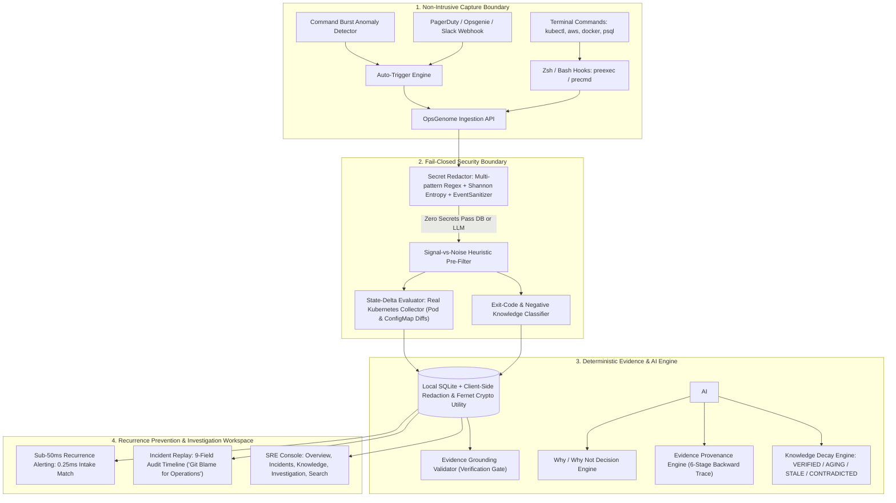

# OpsGenome: The Operational Memory Engine

> **"Production systems remember what happened. OpsGenome remembers why the engineer fixed it. AI proposes; deterministic evidence verifies."**

[](opsgenome/tests/)
[](SECURITY.md)
[](demo/benchmark_core_loop.py)
[](demo/benchmark_core_loop.py)
[](demo/benchmark_core_loop.py)
[](opsgenome/daemon/static/)

---

## 💡 The Core Thesis

AI code assistants have accelerated shipping code by 10x, but incident response remains tribal, undocumented, and fragile. When production goes down at 3 AM:
1. **The real runbook is in someone's muscle memory**, not in Confluence.
2. **Post-mortems are sanitized**: they are written days later, leave out critical terminal context, and never record the failed branches.
3. **The "Silent Recurrence" tax**: the same root cause gets patched three different ways by three different engineers who never speak. When senior engineers leave, the organization's operational intelligence leaves with them.

**OpsGenome transforms active terminal incident response into verifiable organizational memory.** It watches how engineers triage and repair systems, evaluates state transitions deterministically, prunes dead ends, redacts secrets fail-closed, and surfaces past solutions with sub-millisecond single-incident intake matching (0.25 ms) and sub-15 ms search across 1,000 historical incidents.

**Core Principle:**
$$\text{INCIDENT} \longrightarrow \text{EVIDENCE} \longrightarrow \text{DECISION} \longrightarrow \text{OUTCOME} \longrightarrow \text{VERIFICATION} \longrightarrow \text{MEMORY}$$

---

## 🏛️ System Architecture



---

## ⚡ Key Technical Differentiators

### 1. Fail-Closed Security Boundary (Zero Raw Secrets Ever Persisted)
- **Multi-Vendor Patterns:** Redacts AWS keys (`AKIA...`), GCP service account keys, GitHub tokens (`ghp_...`), Slack webhooks, JWT tokens, private keys, database connection strings with embedded passwords, and CLI `--password` flags.
- **EventSanitizer Layer:** Enforces in-memory sanitization before data touches SQLite, log streams, or LLM prompt templates (`<untrusted_operational_data>`).
- **Fail-Closed Fallback:** Any residual secret triggers `SecurityBoundaryViolation` or `[REDACTED_FAIL_CLOSED_ERROR]`. Tested and proven with 15 adversarial attack snippets.
- See details in [SECURITY.md](SECURITY.md).

### 2. Flagship Evidence Provenance Engine
- Follow AI recommendations backwards through a continuous 6-stage chain:
  $$\text{Recommendation} \longrightarrow \text{Evidence} \longrightarrow \text{Incident} \longrightarrow \text{Decision} \longrightarrow \text{Outcome} \longrightarrow \text{Verification}$$
- Every node links directly to authoritative, persisted SQLite records.
- **Evidence Grounding Validator:**
  We do not trust the model's claims by default — every claim is verified against operational evidence, and claims that fail verification are caught and blocked before reaching the user.
  $$\text{Gate Enforcement Rate} = \frac{\text{failed claims successfully blocked from output}}{\text{total failed verification claims}} \quad (\text{Empirically } 100\% \text{ in benchmark: 3/3 blocked, } 30\% \text{ hallucination attempt rate})$$
  In our adversarial 10-claim benchmark, 3 claims failed verification and all 3 were blocked before publication, producing a measured 100% gate-enforcement rate. Per-incident runs dynamically measure `successfully_blocked / total_failed` directly at the publication gate.

### 3. Confidence Terminology Honesty
- We reject vague "Bayesian" marketing claims.
- We explicitly compute **Current Evidence Confidence** using a deterministic Sample Size Damping Factor:
  $$W(N) = 1 - e^{-N / 4.0}$$
  $$\text{Current Evidence Confidence} = (\text{Historical Success Rate} - \text{Escalation Penalty} + \text{Verification Boost}) \cdot W(N)$$
- For small samples ($N < 3$), confidence is withheld under a strict `COLD_START` status to eliminate small-sample overconfidence.

### 4. Incident Replay: "Git Blame for Operational Decisions"
- An interactive scrubber providing a 9-field immutable timeline:
  `Step #` • `Timestamp` • `Source` • `Evidence ID` • `Command` • `Exit Code` • `State Transition` • `Result` • `Decision & Verification Status`.
- **Never Trust Exit Code 0 (Real Kubernetes State Collector):** OpsGenome evaluates concrete before/after resource diffs via its real Kubernetes State Collector ([`opsgenome/watcher/k8s.py`](file:///Users/srinjoypramanick/OPsGenome/opsgenome/watcher/k8s.py)). The collector directly inspects live cluster pods (phases, `0/1` readiness counts, container restarts, failure reasons like `CrashLoopBackOff` or `Error`, deletion timestamps) and ConfigMaps (`resourceVersion` and SHA-256 checksums). Commands that return exit code `0` without resolving pod failures or mutating resource versions are deterministically classified as **Known Dead Ends** rather than fixes. In passive shell capture, hooks record commands, exit codes, and durations; terminal stdout/stderr stream capture via a dedicated PTY wrapper is documented in [`ROADMAP.md`](file:///Users/srinjoypramanick/OPsGenome/ROADMAP.md) as planned work.

### 5. Single Authoritative Ground Truth Dataset
- Pre-seeded with **11 realistic historical production incidents** spanning 10 weeks of simulated operational history on `payments-deploy`.
- Idempotent seeding guaranteed across environments.

---

## 📊 Benchmark & Performance SLA

Measured locally on Apple Silicon (macOS arm64, Python 3.14.6, SQLite 3.50.4):
```bash
PYTHONPATH=. python3 demo/benchmark_core_loop.py
```

| Pipeline Stage / Metric | Measured Benchmark | SLA Target | Status |
| :--- | :--- | :--- | :--- |
| **Total Core Operational Loop** | **35.19 ms** | $< 1,000$ ms | **PASS** |
| **Recurrence Intake Matching** | **0.25 ms** | $< 50$ ms | **PASS** |
| **Recurrence Search (100 incidents scale)** | **p50: 1.28 ms, p95: 1.40 ms** | $< 50$ ms | **PASS** |
| **Recurrence Search (1,000 incidents scale)** | **p50: 13.35 ms, p95: 17.09 ms** | $< 50$ ms | **PASS** |
| **Recurrence Search (10,000 incidents scale)** | **p50: 155.30 ms, p95: 160.89 ms** | $< 250$ ms | **PASS** |
| **Fail-Closed Redaction Throughput** | **42,020 ops/sec** | $> 10,000$ ops/sec | **PASS** |
| **Gate Enforcement Rate (Adversarial Benchmark)** | **100% Blocked (3/3)** | $100\%$ | **PASS** |
| **Peak Memory Footprint (RSS)** | **151.6 MB** | $< 512$ MB | **PASS** |

---

## 🚀 Quickstart

### 1. Clone & Setup
```bash
git clone https://github.com/your-org/OpsGenome.git
cd OpsGenome
pip install -e .
```

### 2. Start OpsGenome
```bash
# Start backend daemon (port 8765)
./run_opsgenome.sh

# In a second terminal, start frontend console (port 3000)
python3 run_frontend.py
```
Open **[http://localhost:3000](http://localhost:3000)** (or `http://localhost:8765`) to view the Linear/Apple-inspired SRE console.

### 3. Run the Live 5-Minute Hackathon Demo
Follow the minute-by-minute pitch guide in [DEMO.md](DEMO.md):
```bash
python3 -m demo.run_hackathon_demo
```

### 4. Run Full Test Suite
```bash
pytest -v
```
*61 passing unit, security boundary, grounding, and live Kubernetes integration tests in ~6.9s.*

---

## 🖥️ User Interface: 5 Consolidated SRE Views

The OpsGenome dashboard is built with a high-density, high-legibility SRE console design (`#F8FAFC` slate canvas, `#FFFFFF` crisp panels, `#0EA5E9` accents, `#0F172A` typography):

1. **Overview:** Total operational memories, living runbooks, measured gate enforcement rate metrics, architectural drift radar, active incident hero card, and quick simulation triggers.
2. **Incidents:** Complete historical log with severity badges, verified resolution tags, and instant provenance/investigation links.
3. **Knowledge:** Living runbooks with Why/Why Not decision comparisons, verified steps, sample-size-damped evidence confidence, and bus factor risk matrix.
4. **Investigation:** Flagship unified operational workspace pairing the step-by-step incident replay scrubber and 9-column audit timeline side-by-side with the Decision & Provenance Engine (Why This / Why Not Ruled Out, Awaiting Human Execution status, and bi-directional clickable evidence citations).
5. **Search:** Sub-millisecond hybrid search with strict Fact / Inference / Recommendation evidence boundaries.

---

## 📄 Documentation Links

- 📋 [DEMO.md](DEMO.md) — 5-minute judge pitch walkthrough, minute-by-minute script, and technical Q&A cheat sheet.
- 🔒 [SECURITY.md](SECURITY.md) — Threat model, redaction regex rules, Shannon entropy scanner, and fail-closed encryption guarantees.
- 🏗️ [ARCHITECTURE.md](ARCHITECTURE.md) — Component architecture, state transitions, and enterprise deployment roadmap.
